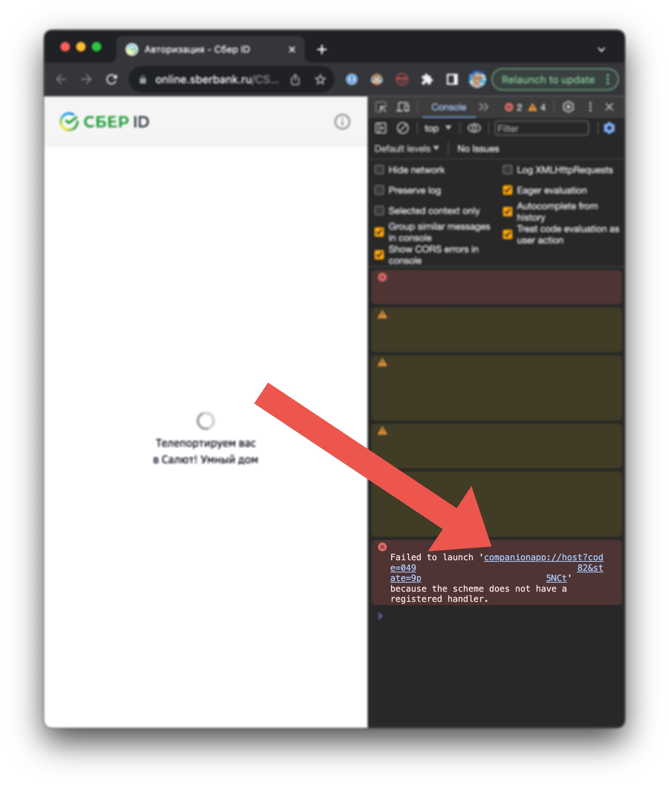

# SberDevices for Home Assistant
Интеграция умных устройств от SberDevices в Home Assistant.  
Написано очень плохо, для личных нужд, предоставлено как есть.

## Установка
1. Установить менеджер дополнений [HACS](https://hacs.xyz/)
2. Зайти в меню **HACS** => **Integrations** => **3 точки** => **Custom repositories**
3. Заполнить небольшую форму значениями:  
    * **Repository**: `https://github.com/altfoxie/ha-sberdevices`  
    * **Category**: `Integration`
4. Перезапустить Home Assistant

> [!NOTE]
> Конечно же, можно установить и вручную. В таком случае, нужно скопировать директорию `custom_components/` в корень конфигурации Home Assistant.

## Использование
1. В меню настроек Home Assistant выбрать **Devices & services**
2. Нажать кнопку в правом нижнем углу **Add integration**
3. Найти **SberDevices** и нажать на него
4. Перейти по ссылке авторизации и авторизоваться
5. Открыть консоль разработчика (F12) и скопировать URL неудачного перенаправления (`companionapp://...`).
    Google Chrome позволяет это сделать, нажав правой кнопкой мыши на ссылке и выбрав **Copy link address**.

    
6. Вставьте скопированную ссылку в поле **URL** и нажмите **Submit**.
7. **Готово!** Ваши умные устройства должны появиться в списке устройств.
